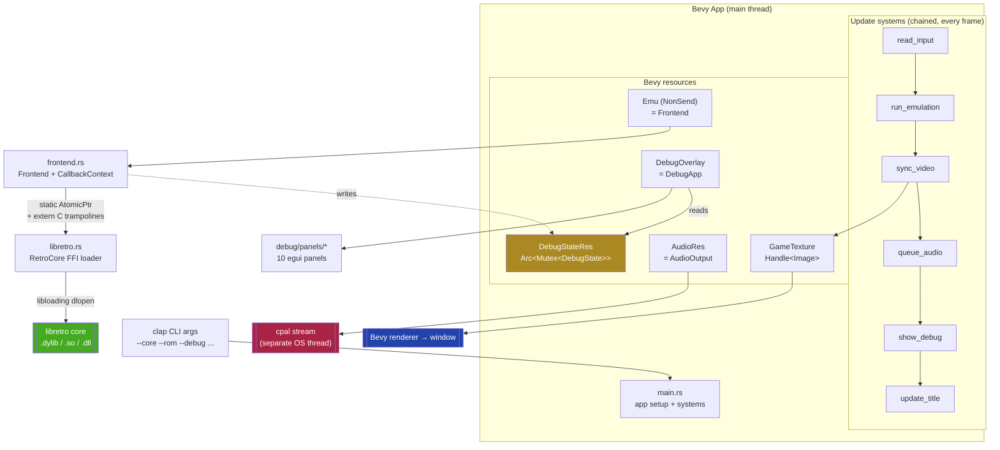

# RustRetro — Architecture

## Overview

RustRetro is a libretro frontend built with Bevy (rendering/window), bevy_egui (debug UI), cpal
(audio), and Capstone (disassembly). The emulation loop runs on the main thread as a Bevy
`NonSend` resource to satisfy OS and libretro threading requirements.

**Source breakdown (~7,400 lines total):**

| Path | Lines | Role |
|------|-------|------|
| `src/main.rs` | ~370 | CLI, Bevy app setup, video/audio/debug/script systems |
| `src/frontend.rs` | ~860 | `Frontend`, libretro callbacks, `retro_run` loop, per-frame capture |
| `src/libretro.rs` | ~590 | FFI bindings, `RetroCore` dynamic loader |
| `src/audio.rs` | ~210 | `AudioOutput` — cpal stream + ring buffer; shared-atomic volume/mute |
| `src/lua_engine.rs` | ~615 | `LuaEngine` (mlua, sandboxed): memory/gui/event/console API + compositor |
| `src/debug/mod.rs` | ~845 | `DebugState`, `MemoryRegion`, `Watch`, `RamSearch`, `NavState`, `Bookmark`, `CodeRegion` |
| `src/debug/window.rs` | ~150 | `DebugApp` — persistent toolbar + dock host |
| `src/debug/dock.rs` | ~320 | `egui_dock` workspace: `Tab`, `Panels`, `TabViewer`, layout persistence |
| `src/debug/vdp_source.rs` | ~90 | VDP register source probe (currently `None` — regs not exposed) |
| `src/debug/panels/` | ~2,900 | egui panels (see below) |

---

## Architecture at a Glance

Three views of the same system: what the pieces are, what one frame does, and how the
Rust↔C callback bridge works.

### Component structure

The Bevy app owns everything. `run_emulation` drives `Frontend`, which talks to the
dynamically-loaded core through the FFI layer. Three outputs leave the app — video, audio,
and debug data — and the shared `DebugState` (amber) is the hub linking live emulation to the
inspection UI.



### One frame, end to end

Each Bevy tick is a strict chain. Input is gathered first, then `core.run()` executes exactly
one frame — firing its C callbacks *synchronously* back into the Frontend, which is why no
locking is needed during the run. The Frontend snapshots CPU/video state into `DebugState`;
only afterward do the later systems convert the framebuffer, hand samples to the audio thread,
and let the overlay render from the now-updated state.

```mermaid
sequenceDiagram
    participant K as Keyboard
    participant BV as Bevy scheduler
    participant FE as Frontend
    participant CORE as libretro core
    participant DS as DebugState<br/>(Arc-Mutex)
    participant GPU as Window
    participant AU as cpal thread

    Note over BV: Update tick (chained systems)
    K->>BV: read_input → [bool;12] buttons
    BV->>FE: run_emulation → run_frame()
    activate FE
    FE->>FE: check breakpoints / run-to / pause
    FE->>CORE: core.run()
    activate CORE
    CORE-->>FE: video_callback(framebuffer)
    CORE-->>FE: audio_batch_callback(samples)
    CORE-->>FE: input_state_callback() → buttons
    deactivate CORE
    FE->>DS: write PC, regs, heatmap, framebuffer
    FE->>FE: capture bookmark / save sidecar if signaled
    deactivate FE
    BV->>GPU: sync_video → to_rgba8() → GameTexture
    BV->>AU: queue_audio → drain ring buffer
    BV->>DS: show_debug → DebugApp reads & renders panels
    BV->>GPU: update_title (every 60 frames)
```

### The FFI callback bridge

libretro cores call C function pointers, which can't carry Rust closure state. The fix:
free-standing `extern "C"` trampolines that recover the instance by reading a static
`AtomicPtr<CallbackContext>` set once at startup. Safe because `retro_run()` is synchronous
and single-threaded, so the callbacks never race.

```
   Rust side                          static bridge                  C side (core)
 ┌────────────────┐                                              ┌──────────────────┐
 │ Frontend::new()│                                              │  retro_run()     │
 │  boxes a       │   write once at startup                      │                  │
 │  CallbackContext├──────────────┐                              │  needs to call   │
 └────────────────┘               │                              │  back into us... │
                                   ▼                              └────────┬─────────┘
                  ┌───────────────────────────────────┐                   │ calls C fn ptr
                  │ static CALLBACK_CONTEXT:           │                   │
                  │   AtomicPtr<CallbackContext>       │                   ▼
                  └───────────────────────────────────┘          ┌──────────────────────┐
                                   ▲                              │ extern "C"           │
                                   │ load(SeqCst)                 │ static_video_callback│
                                   └──────────────────────────────┤ (a free function,    │
                                          deref → (*ptr).method() │  not a closure)      │
                                                                  └──────────────────────┘
```

---

## Module Details

### `main.rs`

Entry point and Bevy app configuration.

**CLI** (`clap` derive):
```
--core <PATH>       (required) libretro core .dylib/.so/.dll
--rom <PATH>        (required) ROM or content file
--scale <N>         Window scale factor (default: 3)
--save-dir <PATH>   SRAM/save-state directory (default: .)
--system-dir <PATH> BIOS directory (default: .)
--fullscreen        Fullscreen mode
--no-audio          Disable audio
--debug             Open debug overlay on startup
```

**Bevy resources:**
- `Emu` (`NonSend`) — wraps `Frontend`; keeps `retro_run()` on the main thread
- `GameTexture` — `Handle<Image>` for the framebuffer sprite
- `WindowScale` — integer scale factor
- `AudioRes` — `AudioOutput` resource
- `DebugStateRes` — `Arc<Mutex<DebugState>>` shared with the debug overlay
- `DebugOverlay` — `DebugApp` instance

**Bevy systems (run every frame, chained in this order):**
- `read_input` — polls the keyboard into the `[bool; 12]` button state; F12 toggles the
  overlay, Space pauses, B captures a bookmark
- `run_emulation` — calls `frontend.run_frame()` (which internally handles frame-step and
  breakpoints before calling `core.run()`)
- `sync_video` — converts framebuffer to RGBA, uploads to `GameTexture`
- `queue_audio` — drains audio samples from `Frontend` into `AudioOutput`
- `show_debug` — renders egui debug overlay when `debug_open`
- `update_title` — updates window title with frame count, resolution, FPS (every 60 frames)

**Pixel format conversion (`to_rgba8`):**

Handles all three libretro pixel formats inline before uploading to the Bevy texture:
- `0` = 0RGB1555 (5 bits per channel)
- `1` = XRGB8888 (memory layout: B, G, R, X)
- `2` = RGB565

---

### `libretro.rs`

All FFI bindings to libretro cores.

**`RetroCore`** — represents a loaded core:
- `load(path)` — opens `.dylib` with `libloading`, resolves all `retro_*` symbols
- `get_system_info()` → `RetroSystemInfo`
- `set_callbacks(env, video, audio, audio_batch, input_poll, input_state)`
- `init()`, `load_game(info)`, `run()`, `unload_game()`, `deinit()`

**Key types:**
- `RetroSystemInfo` — library name, version, valid extensions, `need_fullpath`
- `RetroGameInfo` — path + byte slice for ROM data
- `RetroSystemAVInfo` — geometry (width, height, aspect), timing (fps, sample_rate)
- `RetroMemoryMap` / `RetroMemoryDescriptor` — memory region descriptors from `SET_MEMORY_MAPS`

**Environment command constants** (subset):
```
SET_PIXEL_FORMAT         = 10
GET_SYSTEM_DIRECTORY     = 9
GET_SAVE_DIRECTORY       = 31
SET_SYSTEM_AV_INFO       = 32
SET_MEMORY_MAPS          = 36
GET_VARIABLE             = 15  (not implemented — returns false)
```

**Error type** (`LibretroError`):
- `LoadFailed(String)` — `.dylib` could not be opened or symbol missing
- `ApiVersionMismatch` — core returns version ≠ 1
- `CoreNotLoaded` — called before `load()`
- `GameLoadFailed` — `retro_load_game` returned false

---

### `frontend.rs`

Owns the loaded core and all callback state.

**`Frontend` struct:**
- `core: RetroCore`
- `callback_context: Box<CallbackContext>` — heap-pinned; pointer stored in static
- `av_info: Option<RetroSystemAVInfo>`
- `frame_count: u64`
- `debug_state: SharedDebugState`
- `sidecar_path: Option<PathBuf>`

**`CallbackContext`** — state accessed by libretro C callbacks:
- Save/system directory paths
- Framebuffer bytes, dimensions, pixel format
- Audio sample queue
- Input button states (`[bool; 12]`)
- Reference to `SharedDebugState` (for breakpoints, memory maps, CPU regs, etc.)

**Callback wiring pattern:**

Libretro cores call C function pointers — closures cannot be used because they can't be coerced
to `extern "C" fn`. The solution is a static atomic pointer:

```rust
static CALLBACK_CONTEXT: AtomicPtr<CallbackContext> = AtomicPtr::new(std::ptr::null_mut());

extern "C" fn static_video_callback(data: *const c_void, width: c_uint, height: c_uint, pitch: usize) {
    unsafe {
        let ptr = CALLBACK_CONTEXT.load(Ordering::SeqCst);
        if !ptr.is_null() { (*ptr).video_callback(data, width, height, pitch); }
    }
}
```

The `CallbackContext` pointer is written once during `Frontend::new()` and remains valid for the
lifetime of the program.

**Environment callback handles:**
- `SET_PIXEL_FORMAT` — stores format, accepts XRGB8888 and RGB565
- `GET_SYSTEM_DIRECTORY` / `GET_SAVE_DIRECTORY` — returns configured paths
- `SET_SYSTEM_AV_INFO` — stores FPS and sample rate
- `SET_MEMORY_MAPS` — copies memory region descriptors into `DebugState`
- `GET_VARIABLE` — returns false (core options not implemented)

**Frame loop** (`run_frame()`, called by the Bevy `run_emulation` system):
1. Check breakpoints / run-to address
2. Call `core.run()` — core executes one frame, fires callbacks
3. Update `DebugState` with CPU registers, PC heatmap, framebuffer
4. Handle bookmark capture if signaled
5. Handle sidecar save if signaled

---

### `audio.rs`

**`AudioOutput`:**
- Spawns a cpal output stream on construction (unless `--no-audio`)
- Shared `Arc<Mutex<Vec<i16>>>` ring buffer between emulation thread and cpal callback
- `queue(&[i16])` — appends samples from the libretro audio callback
- `volume`, `muted` — applied by cpal callback at drain time
- `Clone` — allows Bevy resource and debug overlay to share the same instance

---

### `debug/` — Debug Overlay

#### `debug/mod.rs` — Shared State

**`DebugState`** — all data shared between emulation and debug UI:

| Field | Type | Description |
|-------|------|-------------|
| `framebuffer` / `fb_rgba` | `Vec<u8>` | Raw and decoded framebuffer |
| `memory_regions` | `Vec<MemoryRegion>` | From libretro `SET_MEMORY_MAPS` |
| `m68k_*` / `z80_*` | various | CPU register state |
| `pc_heatmap` | `HashMap<u32, u64>` | Address → visit count |
| `bookmarks` | `Vec<Bookmark>` | User-captured state snapshots |
| `code_regions` | `Vec<CodeRegion>` | User-labeled address ranges |
| `breakpoints` | `Vec<u32>` | M68K PC breakpoints (max 8) |
| `paused` / `step_one` | `bool` | Execution control flags |
| `event_log` | `VecDeque<String>` | Rolling event log (500 entries) |

**`MemoryRegion`** — libretro memory descriptor:
- `addr_start`, `addr_end`, `ptr`, `offset`, `disconnect` — for address translation
- `region_type()` → `"ROM" | "RAM" | "VRAM" | "SRAM" | "Unmapped"`
- `host_ptr_for_addr(emu_addr)` — safe address translation using the libretro formula

**`Bookmark`** — serializable state snapshot:
- M68K register set, frame number, PC, 64×48 RGBA thumbnail, editable label + notes

**`CodeRegion`** — serializable address range:
- `addr_start`, `addr_end`, `label`, RGB `color`, `notes`

#### `debug/window.rs` + `debug/dock.rs` — Toolbar + Docking Workspace

`DebugApp` renders a **persistent toolbar** (`TopBottomPanel "debug_toolbar"`) above an
`egui_dock` **workspace** (`dock.rs`). The toolbar holds global controls independent of which
panels are open:

```
◀ Back  ▶ Fwd  |  ▶Run/⏸Pause  ⏭ Step  ⏯ Step Frame  |  Go to: $______  |  PC: $XXXXXX  |  💾 Save layout  ⟲ Reset
```

The dock shows all 14 surfaces as draggable/splittable tabs — multiple visible at once
(default: Disasm central, CPU/Watch/Regions right, the rest in a bottom tabbed strip). The
layout serializes to `rustretro_layout.json`. A shared `NavState` cursor (`DebugState::goto`)
links navigation: clicking an address in Regions/Watch/Search focuses Disasm + Hex via a
one-frame `nav.pending_focus` pulse (cleared centrally after the dock renders).

The Lua **script panel** is *not* a dock tab — it is a separate floating `egui::Window`
(F10) driven by the `show_script_panel` Bevy system, because `LuaEngine` is `!Send`.

#### `debug/panels/` — Individual Panels

| File | Panel | Key Features |
|------|-------|-------------|
| `frame_inspector.rs` | 🖼 Frame | Live framebuffer, pixel inspector, zoom |
| `hex_dump.rs` | 📋 Hex | Hex+ASCII dump of any region; changed-cell amber tint; nav-focus scroll |
| `tile_viewer.rs` | 🧩 Tiles | 8×8 VRAM tile browser |
| `input_monitor.rs` | 🕹 Input | Button state + 120-frame input history |
| `cpu_state.rs` | 🔧 CPU | M68K D0–D7, A0–A7, PC, SR; Z80 regs; delta highlights |
| `disassembly.rs` | 📜 Disasm | Capstone M68K; breakpoints; run-to; label-range; nav-focus |
| `audio_controls.rs` | 🔊 Audio | Volume, mute (shared atomics), sample rate display |
| `frame_log.rs` | 🧾 Log | Scrollable event log with filter |
| `triggers.rs` | ⏸ Triggers | Frame-count and pixel-value pause triggers |
| `regions.rs` | 🗺 Regions | Bookmarks, PC heatmap, code region manager; → goto |
| `watch.rs` | 👁 Watch | Pinned addresses, live values, freeze/lock, change tracking; → goto |
| `ram_search.rs` | 🔍 Search | Iterative cheat-engine narrowing; +Watch / → goto |
| `vdp_registers.rs` | 📺 VDP | Genesis VDP $00–$17 bitfield decode (source not yet wired) |
| `help.rs` | ❓ Help | Static keybinds / panels / about |
| `script_panel.rs` | (F10 window) | Lua load/reload/status + API reference |
| `hex_tint.rs` | (helper) | Changed-cell diff/color used by the hex dump |

---

## Data Flow

```
CLI args parsed by clap
        │
        ▼
Bevy App starts
        │
        ├─ NonSend: Frontend::new()
        │     ├─ RetroCore::load(core_path)      [libretro.rs]
        │     ├─ CallbackContext::new(...)
        │     ├─ core.set_callbacks(statics)
        │     ├─ core.init()
        │     └─ core.load_game(rom_path)
        │
        └─ Resources: GameTexture, AudioRes, DebugStateRes, DebugOverlay
                │
                ▼
        Bevy schedule (every frame)
                │
                ├─ run_emulation → frontend.run_frame()
                │     └─ core.run()
                │           ├─ video_callback → DebugState.update_frame()
                │           ├─ audio_callback → AudioOutput.queue()
                │           └─ input_state_callback ← input [bool;12]
                │
                ├─ sync_video
                │     └─ to_rgba8(framebuffer) → GameTexture (Bevy Image)
                │
                ├─ queue_audio
                │     └─ frontend.drain_audio() → AudioOutput.queue()
                │
                └─ show_debug (when debug_open)
                      └─ DebugApp::show(egui_ctx)
```

---

## Callback Threading Model

`retro_run()` is called from the Bevy main thread (via `NonSend`). All libretro callbacks fire
synchronously within that call, so there is no concurrent access to `CallbackContext`.

`DebugState` is behind `Arc<Mutex<>>` because the Bevy `show_debug` system (also on main thread)
reads it between frames. The lock is briefly held during each system that accesses it.

`AudioOutput` uses a separate `Arc<Mutex<Vec<i16>>>` ring buffer. The cpal stream runs on its own
OS thread and holds this lock only to drain samples, keeping audio latency low.

---

## Error Handling

- `anyhow::Result` used throughout for flexible propagation
- `LibretroError` (thiserror) for typed core-loading failures
- All `unsafe` blocks are isolated to FFI call sites in `libretro.rs` and the static callback
  functions in `frontend.rs`

---

## Known Limitations

- `RETRO_ENVIRONMENT_GET_VARIABLE` returns false — cores requiring options may behave incorrectly
- Single joypad only (port 0)
- Save state serialization not implemented (directories are passed to cores). This also stubs
  out the Lua `savestate.*` API and blocks rewind.
- No disc / multi-file content support; no rewind
- No full cheat-code engine, though the Watch panel's freeze/lock provides per-address value forcing
- VDP registers are not exposed by the loaded cores (write-only hardware); the VDP panel decodes
  but shows zeros until a control-port-write intercept is added (`src/debug/vdp_source.rs`)
- "What changed this address?" is **frame-granular** (libretro exposes no per-access memory hook),
  not instruction-exact
- `egui_dock` is pinned to 0.16 (egui 0.31); the planned egui/Bevy upgrade must bump it in lockstep

> **Note:** MAME 2003-Plus previously crashed in `retro_load_game`; this was the wrong
> environment-callback constants in the FFI layer, now fixed (see [DEBUGGING.md](DEBUGGING.md)).
> MAME cores load once the correct `--system-dir` BIOS layout is provided.
